# Cohere Developer Notes

This is a really quick overview of the site structure with some instructions further down on setting up the database and config files.

**NOTE:** While the Cohere code base is released under the LGPL license: http://www.fsf.org/licensing/licenses/lgpl.html, developers should be aware that the **admin** and the **timeline\_2.3.0** folder contains third party code that is under the GPL license: http://www.fsf.org/licensing/licenses/gpl-3.0.html

If you need more help at present, please ask your questions through the Google [Cohere developer group](http://groups.google.com/group/coheregroup)

## A Quick What’s Where

The top level has the config.php file, (see 4. [Edit settings in /config.php to point to your set up and database](#config), below)

The top level has the main primary php files for the main pages of the site: the index file, and the main context pages, like user, search, groups, the login, logout and reset pages and the fav icon etc..

**Folders:**

*   **\_util** \- This is the code used to create the api apilib comments. You will need PHPDocumentor installed and you will need to edit the batch files in this folder as appropriate if you want to use this on your version of the Cohere code.
*   **admin** \- This folder has various files that produce and display various statistics about the activity on the site. If you are a user who has the ‘IsAdministrator’ field set to ‘Y’, you will see an extra menu item when logged in at the top of the screen called admin, for accessing these stats reports.
*   **api** \- This folder holds the Cohere services file that processes incoming service request, (see core/apilib.php for the actual guts).
*   **Auth** \- This is the OpenID library.
*   **docs** \- This is where the developer docs are.
*   **help** \- This is where the help pages are.
*   **images** \- This is where all the graphics for the site are. It has various subfolders.
*   **io** \- This folder holds the php files that handle the various import options in Cohere like rss, rdf and compendium.
*   **language** - This folder holds some language files used by Hub\_Error and also email templates. Retro-fitted from Evidence Hub. Needs completing at some point.
    *   **en/mailtemplates** - This folder holds text files templates for the various emails Cohere can send.
*   **ui** - This folder has ui files that are included in many other places e.g. header, footer, sidebar etc.
    *   **screencasts** - This folder holds some screencasts that show how to used areas of the site.
    *   **visualize** - This folder holds the java script files that are responsible for handling the display of the various data visualisations offered on the Cohere website, like the network or timeline views etc.
        *   **connectionnetjars** - This folder holds the jar files for the connection net.
        *   **timeline\_2.3.0** - This folder holds the MIT library for drawing the timeline. It is under MIT and GPL licenses
*   **install** - This folder has the sql files needed to create a Cohere database and install the default data. See [Setting up a Cohere Server](#setup) below
*   **jetpack** - This folder and its subfolders hold all code, image etc. related to our Firefox Jetpack. This is a new and currently experimental possible future replacement for the our main Firefox extension.
*   **ontology** - This folder holds pdf and cohere.owl schema for the Cohere RDF import.
*   **core** - This folder holds all the main libraries of php methods used by the site. It also holds all the main php class files for the primary object of the site, like user, node, linktype etc..
    *   **formats** - This folder has the php files that format the Cohere service reply text into the request format, like XML or json etc. There is one file per supported format.
    *   **lib/jdp-twitterlibphp** - This is the library use for Tweeting.
    *   **lib/recaptcha-php-1.10** - This is the recaptcha library.
    *   **lib/rss** - This is the library used for processing rss<./li>
*   **plugin** - This folder's subfolders have files related to the FireFox plugin and files shared by the website and the plugin.
    *   **ui** - This folder has php files for various popup pages used by the website and the FireFox plugin, like create an idea and create a connection popups.
    *   **download** - This folder has the FireFox plugin related files for downloading and auto-updating the plugin.
*   **snippet** - This folder has the pages that are used when embedding a Cohere snippet in another site. Each type of embed has its own page and there are also special header and footer files for these pages.
*   **uploads** - This folder holds user profile pictures. Each user will have a folder in here labelled uniquely. This folder also holds the default user and group images to use when no image has been uploaded.

  

## Setting up a Cohere Server

### Setup the database. 

You can find the schema for the database here: [/install/db.sql](/install/db.sql). The sql in this file will create a database called `cohere` and all the tables and relationships cohere requires. If you want to change the name of the database, edit the `CREATE DATABASE..` line and rename. Note, given the original age of this system, the character set it uses is latin1. You may want to edit the table creation statments to use UTF8 these days.

### Add the default data

To add all the default data that the website will need to have in the database to get started with, you need to edit and then run the sql in the file [/install/default-data.sql](../install/default-data.sql) into the 'cohere' database you created in step 1, (more details below):

We have setup some default data for Cohere.  `default-data.sql` contains default node types a.k.a. roles, and link types, and a default user who owns them.  You may want to modify these to be different default data. If you do, make sure you adjust the  `$CFG->defaultRoleGroupID` in the config.php file accordingly. Make sure you edit the user entry and add your email address and password for you defualt user.

**Note:** It is these default role and link types that are copied to new users as their starting pot of types to select from.
  

### Setup the Config File

To setup the config file you will first need to copy `/config-sample.php` file to `/config.php`. there are addigional comments explaining config properties inside the `config-sample.php` file. Some setting you will not need to change as they are simply default or static data for the site.  

The following parameters are ones you really DO need to change for your site to work:  

`$CFG->homeAddress = "http://web/path/to/website/";`
( home address is the base url for the website and must end with trailing '/' )  
    
`$CFG->dirAddress = "/file/path/to/website/";`  
(dir address is the base file path for the website)  
    
`$CFG->databaseaddress = "localhost";` 
(the database address, e.g. localhost or a url etc.)  
    
`$CFG->databaseuser`
(the database username that Cohere uses to login to the database)  
    
`$CFG->databasepass`
(the database password to go with the above username)  
    
`$CFG->databasename`  
(the database name for the database Cohere is to use)  
    
`$CFG->workdir = "/tmp/"`
(the path to a temp directory that Cohere can use)  
    
`$CFG->RECAPTCHA_PUBLIC = "<add recaptcha public key here>"; `
`$CFG->RECAPTCHA_PRIVATE = "<add recaptcha private key here>";`
(recaptcha public/private keys - you will need to get new keys for your website)  
    
`$CFG->RECAPTCHA_PUBLIC = "6Lf9oggAAAAAAAkA3Ip9bnqAItDucHKCNGjtfQSq";`
`$CFG->RECAPTCHA_PRIVATE = "6Lf9oggAAAAAAG4gi5xOhqqs0D1RE\_hN5ZHPnL3c";`
(for working on locahost these should just work so you can replace above with these and test first, then get new keys for your live site or if these don't work)  
      
`$CFG->BINGMAPS\_KEY = "<add Bing key here for geo code look ups>";`
(Google maps: You will need to go and get a Google maps key for your site)  
    
`$CFG->GOOGLE\_ANALYTICS\_KEY = "";`
(Bing map key: You will need to go and get a Bing key for your site) [https://www.bingmapsportal.com/](https://www.bingmapsportal.com/)  
Used in code for long/lat from address: [https://docs.microsoft.com/en-us/bingmaps/rest-services/locations/find-a-location-by-query](https://docs.microsoft.com/en-us/bingmaps/rest-services/locations/find-a-location-by-query)  
      
### Hardcoded URL

**Important:**There are many places in the server code where there are hard coded url's to the Cohere or KMi websites. Although we have tried to use the config setting where possible, there are still many that you will need to edit.
    
**The section below talks about the places you will need to modify the urls in the code as well as other code modification you may need to make, so please go through it carefully!!**

Below is a screen shot of the search results for open.ac.uk in Cohere verson 2, (where the match count is not stated, it means there is 1):

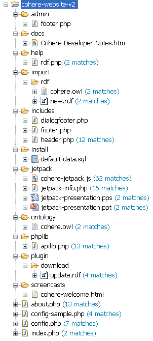

Let's look at these a folder at a time:

#### admin

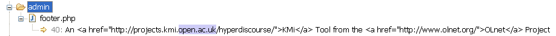

The footer.php file has a reference to KMi home page for the related project. It also has a reference to OLnet website, which is the project currently funding Cohere. You may want to leave these as they are on your site or change the footer to your own link(s). See also ui/footer.php and dialogfooter.php which has the same links.

#### docs

Well... your here. The currently available documentation for the Cohere website

#### help

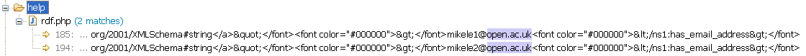

These two are the email address for the author of the rdf component in Cohere. You will want to lave these.

#### io

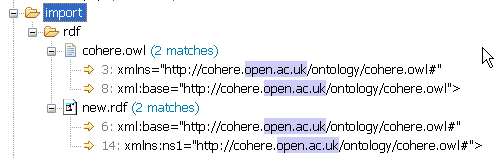

You will need to replace these four urls with your own urls to your local ontology folder (in case for some reason ours moves)

#### ui

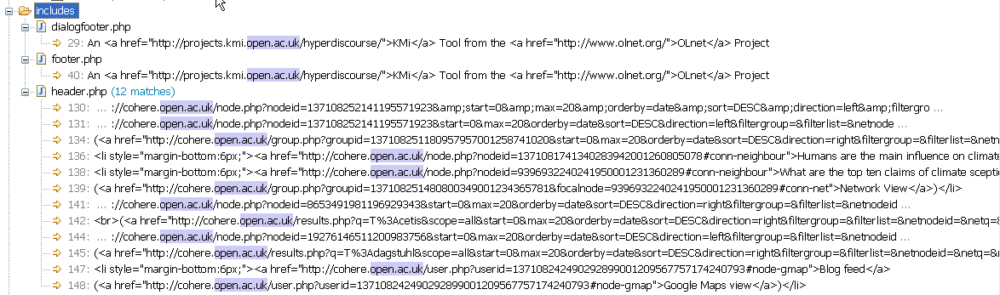

The dialogfooter.php and footer.php files have a reference to KMi home page for the related project. They also has a reference to OLnet website, which is the project currently funding Cohere. You may want to leave these as they are on your site or change the footers completely to your own link(s). (see slao help/footer.php above)

The header.php file contains the search examples. As these are urls to actual Cohere searches and there related data, you will have to either leave them completely alone (but be aware people will be redirected to Cohere.open.ac.uk if they click them, or better, replace all the search examples with examples from your own site.

#### install

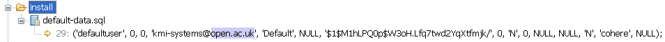

The default-data.sql file holds default data for Cohere ([see 2. above](#defaultdata)). You will wnat to edit the email address and the password for this default user.

#### jetpack

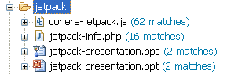

This one is tool scary to show you. The Cohere Jetpack is an experimental new Firefox extension based on the jetpack prototype library. If you really want to offer this to your users, then you will need to replace all the urls particularly in the cohere-jetpack.js. Otherwise I would just remove the link to it on the includes/sidebar.php and forget about this folder. We will be re-writing this Jetpack using the new Jetpack api as soon as it is sufficiently mature.

#### ontology

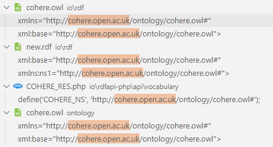

You will need to replace these with your own url.

#### core

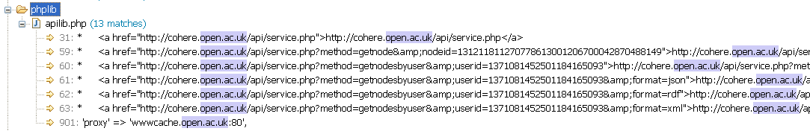

The first 12 of these urls are just in the examples at the top of the file. You can leave them.

However, the last one is a reference to our proxy. You will need to edit this to your proxy, or is you don't have one, remove the proxy code line.

#### plugin

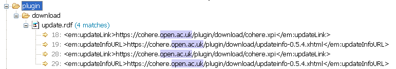

These are important. They are related to the auto-updating of the Cohere Firefox extension plugin. If you decide to offer your users the FireFox extension and you want it to write to your database, you will need to edit the cohere-firefox-plugin code (released in a separate folder in svn so that the url it uses to access the services is yours and you will need to edit these urls so that your users get auto updates from your version not ours.

#### ui/screencasts

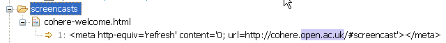

You will need to replace this with your own url.

#### about.php

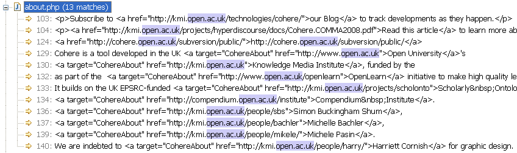

OK, you probably just want to do your own about page. You may want to pick through and leave some links to Cohere main, that is up to you.

#### config-sample.php

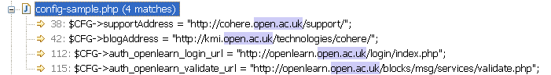

This is the file you will need to copy over and rename config.php for your site as mentioned in 3 and 4 above. We give you some defaults for the support and blog. You will have to decide if you want to keep a link to our openlean site.

**IMPORTANT:** There is code in the file core/accesslib.php to validate against OpenLearn. You will need to review/remove this code as it will only work properly on the same subdomain.

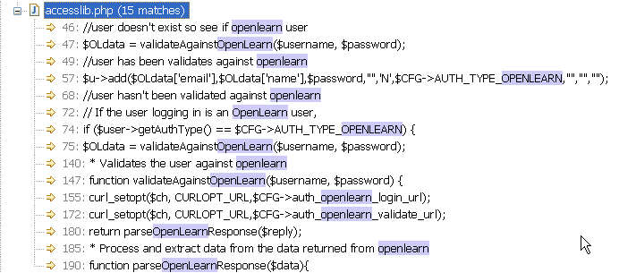

#### config.php

You will replace this file with your own version copied from the config-sample (see sections 3 and 4 above).

#### index.php

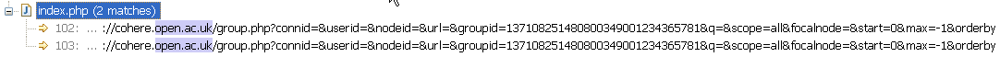

As with the header.php file, these are links to example searches of Cohere. You will want to edit these to your own example otherwise users will be redirected to our site. You may also want to think about changing the **Twitter** readers to point at your own account / searches etc.